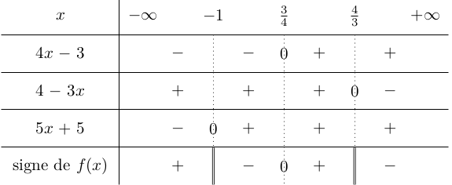
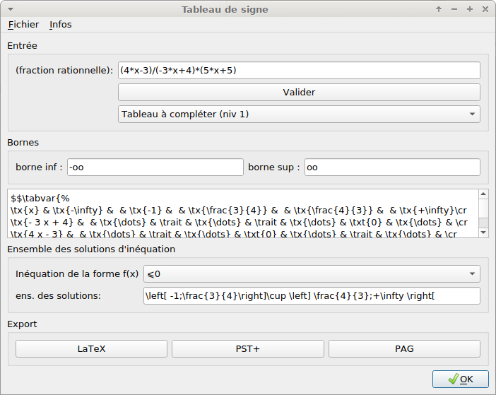

TableauSigne
============

Produire des sorties TikZ/tex/pst/pag de tableaux de signe

* [Téléchargement](https://github.com/TeddyBoomer/TableauSigne/releases/tag/v2.0)
* Installation: voir en bas de cette page
* Documentation: fournie dans le dossier d'installation (voir en bas de page)

Une petite illustration du module:
==================================

Exemple:

```python
from TableauSigne import *
A = randExpr(3) 
(4*x - 3)/((-3*x + 4)*(5*x + 5))

B = TableauSigne(A)
B.get_solutions('+0')

'\left] -\infty;-1\right[\cup \left[ \frac{3}{4};\frac{4}{3}\\right['

print(B.tab2tkz())
B.export_tkz()
```

**Sortie TikZ** (un peu de travail manuel nécessaire sur certains coefficients)

```latex
%\usepackage{tkz-tab}
\begin{tikzpicture}
\tkzTabInit[nocadre,lgt=2.5,espcl=1.5]{$x$ /0.8 ,
$4 x - 3$ /0.8 ,
$5 x + 5$ /0.8 ,
$4 + \left(-3\right) x$ /0.8 ,
signe de $f(x)$ /0.8}{$-\infty$ , $-1$ , $\frac{3}{4}$ , $\frac{4}{3}$ , $+\infty$}
\tkzTabLine{ , - , d , - , z , + , d , + , }
\tkzTabLine{ , - , d , + , t , + , d , + , }
\tkzTabLine{ , + , d , + , t , + , d , - , }
\tkzTabLine{, +, d, -, z, +, d, -, }
\end{tikzpicture}
```

**Rendu LaTeX**:



Des scripts python TabSigne, TabSigneSimplif et TabSigneGUI utilisent le module
pour produire directement des sorties tex/pst/pag.

Le script *TabSigneGUI.py* est une interface graphique et nécessite
l'installation de `PyQt5`. Il s'appelle directement en ligne de commande (il
est intégré dans le chemin système); vous pouvez créer une icône de raccourcis
pour le lancer…



*autres possibilités: export PAG pour PdfAdd*: voir le site
http://www.xm1math.net/pdfadd/index.html

Installation/Mise à jour: 
=========================

Module en Python3. Il vous est conseillé d'utiliser une
version de Python >=3.4. En effet, à partir de là, l'installateur pip
standardise l'installation des modules (et utilise le plus récent format
d'archive **wheel**)

L'installateur pip veillera à installer les dépendances **sauf PyQt5** qui est
plus lourd à installer.

Si vous voulez avoir l'interface graphique, il faut aussi installer ce module.

Pour windows:

```
py -3 -m pip install -U \chemin\vers\TableauSigne-xxx-py3-none-any.whl
```

Pour linux:

```
pip3 install  -U /chemin/vers/TableauSigne-xxx-py3-none-any.whl
```

Le paramètre `-U` (ou `--upgrade`) est facultatif: il indique l'autorisation de
mise à jour pour accepter la version la plus récente si vous avez déjà installé
une version précédente.


Documentation du module:
========================

Elle est fournie dans le sous-dossier `data/doc` de l'installation. 

Par exemple si vous faites une installation pour votre utilisateur sous linux, elle sera vraisemblablement dans `~/.local/lib/python3.x/site-packages/TableauSigne`

Pour Windows (cas d'une installation système): `C:/Python3.x/site-packages/TableauSigne`
