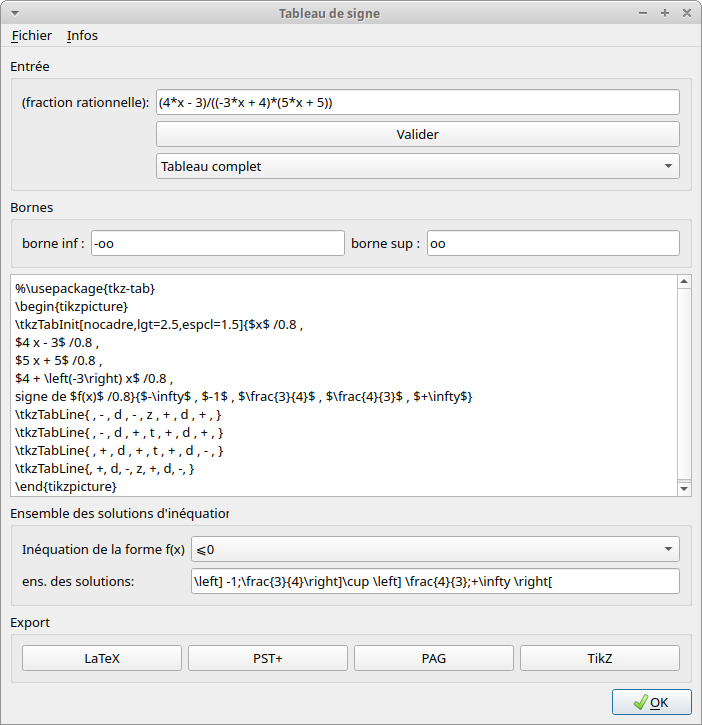

TableauSigne
============

produire des sorties tex/pst/pag de tableaux de signe

Une petite illustration des capacités du module:

Exemple:

```python
from TableauSigne import *
A = randExpr(3) 
(4*x - 3)/((-3*x + 4)*(5*x + 5))

B = TableauSigne(A)
B.get_solutions('+0')

'\left] -\infty;-1\right[\cup \left[ \frac{3}{4};\frac{4}{3}\\right['

print(B.tab2latex())
B.export_pst()
```

```latex
$$\tabvar{%
\tx{x} & \tx{-\infty} &  & \tx{-1} &  & \tx{\frac{3}{4}} &  & \tx{\frac{4}{3}} &  & \tx{+\infty}\cr
\tx{- 3 x + 4} &  & \tx{+} & \tx{|} & \tx{+} & \tx{|} & \tx{+} & \txt{0} & \tx{-} & \cr
\tx{5 x + 5} &  & \tx{-} & \txt{0} & \tx{+} & \tx{|} & \tx{+} & \tx{|} & \tx{+} & \cr
\tx{4 x -3} &  & \tx{-} & \tx{|} & \tx{-} & \txt{0} & \tx{+} & \tx{|} & \tx{+} & \cr
\tx{\text{signe de }f} &  & \tx{+} & \dbt & \tx{-} & \txt{0} & \tx{+} & \dbt & \tx{-} & \cr}$$
```
**Rendu LaTeX/PdfAdd**:


Des scripts python TabSigne, TabSigneSimplif et TabSigneGUI utilisent le module pour produire directement des sorties tex/pst/pag. 

Le dernier script est une interface graphique et nécessite l'installation de `PyQt5`.



voir le site http://www.xm1math.net/pdfadd/index.html

Installation/Mise à jour: 
=========================

Module en Python3. Il vous est conseillé d'utiliser une
version de Python >=3.4. En effet, à partir de là, l'installateur pip
standardise l'installation des modules (et utilise le plus récent format
d'archive **wheel**)

L'installateur pip veillera à installer les dépendances **sauf PyQt5** qui est plus lourd à installer. 

Si vous voulez avoir l'interface graphique, il faut aussi installer ce module.

Pour windows:

```
py -3 -m pip install -U \chemin\vers\TableauSigne-xxx-py3-none-any.whl
```

Pour linux:

```
pip3 install  -U /chemin/vers/TableauSigne-xxx-py3-none-any.whl
```

Le paramètre `-U` (ou `--upgrade`) est facultatif: il indique l'autorisation de mise à jour pour accepter la version la plus récente si vous avez déjà installé une version précédente.


Documentation du module:
========================

Elle est fournie dans le sous-dossier `data/doc` de l'installation. 

Par exemple si vous faites une installation pour votre utilisateur sous linux, elle sera vraisemblablement dans `~/.local/lib/python3.x/site-packages/TableauSigne`

Pour Windows (cas d'une installation système): `C:/Python3.x/site-packages/TableauSigne`
